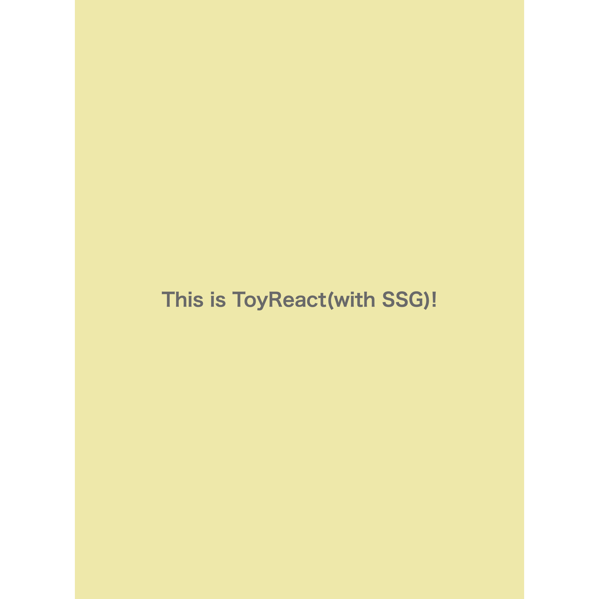

本章では、[SSRを実装する](./SSRを実装する.md) で作成した API を用いて、SSG を実装し、その仕組みを学びます。

SSG は、SSR でリクエストごとに生成していた HTML 文字列を、予め(ビルドなどのタイミングで)生成し、ファイルに書き込むことで実現します。

ToyReact 側の API は全て出揃っているので、`/fixtures` 側に実装を追加します。

`/fixtures/ssg-app/src/generate.js` ファイルを開き、以下の処理を追加しましょう。

```js
'use strict';
const path = require('path');
const fs = require('fs');
const ToyReact = require('toy-react');
const ToyReactDOMServer = require('toy-react-dom/server');
const { App } = require('./components/App');

const routes = fs
    .readdirSync(path.resolve(__dirname, './pages'), { withFileTypes: true })
    .filter((dirent) => dirent.name.endsWith('.js'))
    .map((dirent) => dirent.name.replace(/\.js$/, ''));

(() => {
    routes.forEach((route) => {
        const content = ToyReactDOMServer.renderToString(<App />);
        const template = fs.readFileSync(
            path.resolve(__dirname, 'app.html'),
            'utf-8'
        );
        const html = template.replace('<!-- app -->', content);
        if (!fs.existsSync(path.resolve(__dirname, '../out'))) {
            fs.mkdirSync(path.resolve(__dirname, '../out'));
        }
        const outPath = path.resolve(__dirname, `../out/${route}.html`);
        fs.writeFileSync(outPath, html);
        fs.copyFileSync(
            path.resolve(__dirname, `./${route}.css`),
            path.resolve(__dirname, `../out/${route}.css`)
        );
        if (!fs.existsSync(path.resolve(__dirname, '../out/pages'))) {
            fs.mkdirSync(path.resolve(__dirname, '../out/pages'));
        }
        fs.copyFileSync(
            path.resolve(__dirname, `./pages/${route}.js`),
            path.resolve(__dirname, `../out/pages/${route}.js`)
        );
    });
})();
```

Next.js の Pages Router のように、`/pages` ディレクトリに追加したファイルが、そのまま HTML ファイルとして出力されるようにします。

SSR と同様に、テンプレートの HTML ファイルに `renderToString` で生成した HTML 文字列を埋め込み、これをファイルとして `/out` ディレクトリに書き出します。

`/fixtures/ssg-app/src/pages/` ディレクトリに、以下のような `index.js` を追加してみましょう。

```js
'use strict';

const ToyReact = require('toy-react');
const ToyReactDOM = require('toy-react-dom');

require('../assets/styles/global.css');

const { App } = require('../components/App');

ToyReactDOM.hydrate(<App />, document.getElementById('root'));
```

`npm run dev -w ssg-app` を実行し、`npm run export -w ssg-app` を実行してみましょう。

`/ssg-app` の直下に `/out` ディレクトリが生成されてるはずです。`npm run serve -w ssg-app` を実行し、サーバーを立ち上げてみましょう。

http://localhost:3002 を開くと、以下のような表示になっていれば正常に動いています！



実装済みのものは `npx create-toy-react-app 2023 ssg-completed <my-app>` で手元にダウンロード出来ます。

---

ここまでで、SSRとSSGの実装は終了です。お疲れ様でした。

[おわりに](./おわりに.md)
