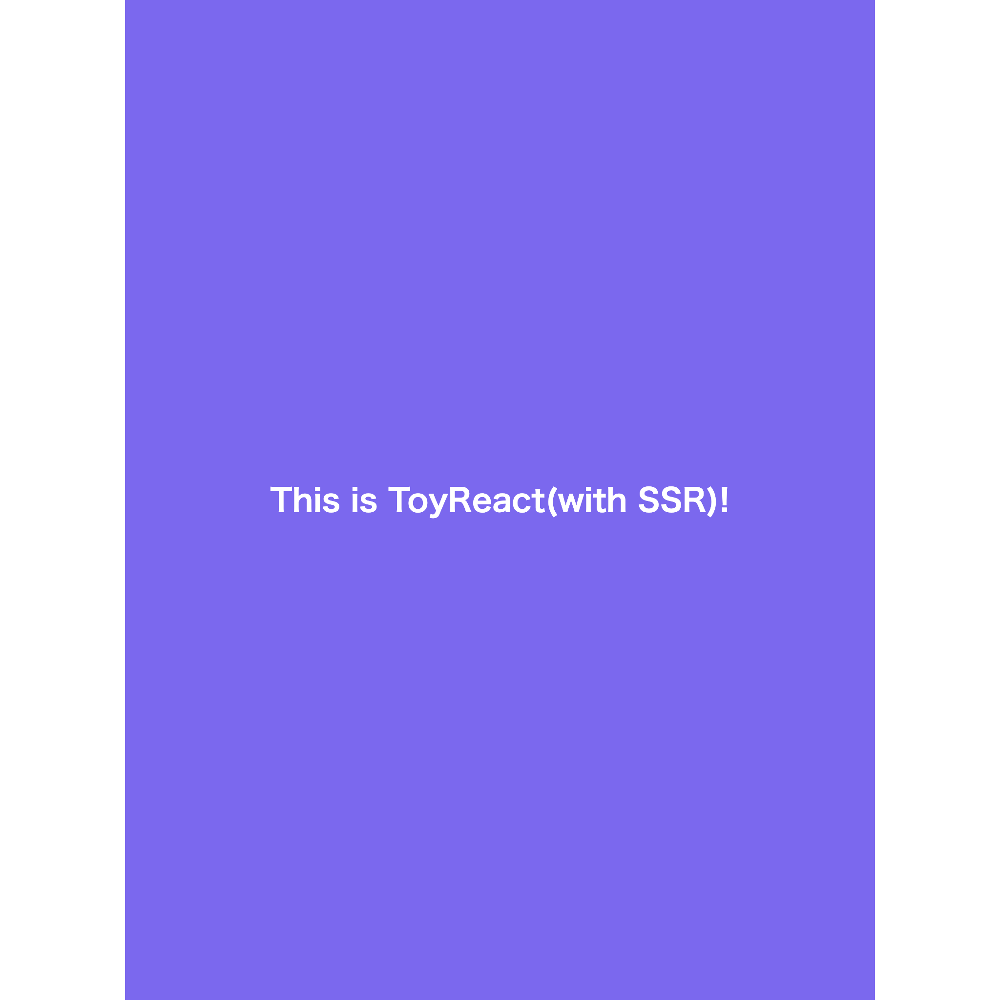

本章では簡単な SSR を実装し、その仕組みを学びます。

## `ToyReactDOMServer.renderToString` の実装

まずは `ToyReactDOMServer.renderToString` を実装します。

[SSR・SSGの実装を始める前に](./SSR・SSGの実装をはじめる前に.md) でもお話したように、`renderToString` 関数とは受け取ったコンポーネントを HTML 文字列に変換する関数です。

`/packages/toy-react-dom/src/server` ディレクトリに移動してみましょう。`ToyReactDOMStringRenderer.js` と `ToyReactPartialRenderer.js` の2ファイルが含まれています。

`ToyReactPartialRenderer.js` を以下のように変更しましょう。

```js
'use strict';

class ToyReactPartialRenderer {
    constructor(children, options) {}
}

export default ToyReactPartialRenderer;
```

`ToyReactPartialRenderer` は class で、`renderToString` 側でインスタンスを生成して使います。これを踏まえ `ToyReactDOMStringRenderer.js` を以下のように変更しましょう。

```js
'use strict';

import ToyReactPartialRenderer from './ToyReactPartialRenderer';

export function renderToString(element, options) {
    const renderer = new ToyReactPartialRenderer(element, options);
}
```

`ToyReactPartialRenderer` クラスには、`renderToString` の引数の `element` と `options` をそのまま渡してインスタンス化します。

今回、`options` は特に使用しませんが、元の react-dom の仕様に沿う形で用意しています。

それでは `ToyReactPartialRenderer.js` を変更し、プロパティとメソッドを用意しましょう。

```js
'use strict';

function isEvent(key) {
    return key.startsWith('on');
}
function isStyle(key) {
    return key === 'style';
}
function isProperty(key) {
    return key !== 'children' && !isEvent(key) && !isStyle(key);
}

class ToyReactPartialRenderer {
    constructor(children, options) {
        this.stack = children;
        this.options = options;
        this.exhausted = false;
    }

    destroy() {
        if (!this.exhausted) {
            this.exhausted = true;
        }
    }

    read() {
        if (this.exhausted) {
            return null;
        }

        return this.renderElement(this.stack);
    }

    renderElement(element) {
        return '';
    }
}

export default ToyReactPartialRenderer;
```

しれっと、ここで追加した `isEvent` `isStyle` `isProperty` は後ほど使用します。ToyReact の reconciler 実装を行った方は見覚えがあるものかもしれません。

`ToyReactPartialRenderer` を呼び出す側の `ToyReactDOMStringRenderer.js` も変えてしまいましょう。

```js
'use strict';

import ToyReactPartialRenderer from './ToyReactPartialRenderer';

export function renderToString(element, options) {
    const renderer = new ToyReactPartialRenderer(element, options);
    try {
        const markup = renderer.read();
        return markup;
    } finally {
        renderer.destroy();
    }
}
```

`renderToString` 関数では、`ToyReactPartialRenderer` クラスの `read` と `destroy` が呼び出されています。

`read` は、`stack` プロパティに格納されたコンポーネントを、`renderElement` 関数に渡し、その戻り値を返すメソッドです。

`renderElement` のロジックは後ほど書きますが、文字列を返すメソッドになります。

`destroy` は `read` の終了後に呼び出され、これが呼び出された以降、コンポーネントの HTML 文字列への変換を停止します。

今回、これの恩恵を受ける場面はありませんが、 [react-dom の実装](https://github.com/facebook/react/blob/cae635054e17a6f107a39d328649137b83f25972/packages/react-dom/src/server/ReactPartialRenderer.js#L848-L854) をなるべく再現する目的で用意してみました。

では、`ToyReactPartialRenderer` クラスを完成させましょう。`ToyReactDOMStringRenderer.js` を開き、`renderElement` の中を記述してください。

```js
'use strict';

// ~~~

class ToyReactPartialRenderer {
    constructor(children, options) {
        this.stack = children;
        this.options = options;
        this.exhausted = false;
    }

    // ~~~

    renderElement(element) {
        if (element.type === 'TEXT_ELEMENT') {
            return element.props.nodeValue;
        }

        if (element.type instanceof Function) {
            const component = element.type(element.props || {});
            const child = component.render ? component.render() : component;
            return this.renderElement(child);
        }

        const props = element.props || {};
        const attributes = Object.keys(props)
            .filter(isProperty)
            .map((key) => `${key}="${props[key]}"`)
            .join(' ');
        const children = (props.children || [])
            .map((child) => this.renderElement(child))
            .join('');

        return `<${element.type} ${attributes}>${children}</${element.type}>`;
    }
}

export default ToyReactPartialRenderer;
```

1つずつ処理を見ていきましょう。

`element.type === 'TEXT_ELEMENT'` で比較している箇所は、JSX要素ではなくただのテキストを処理するためのものです。

例えば `<div>Hello</div>` が渡されたとして、これを ToyReact で要素ツリーに変換すると、以下になります。

```js
{
    type: 'div',
    props: {
        children: [
            {
                type: 'TEXT_ELEMENT',
                props: {
                    nodeValue: 'Hello',
                },
            },
        ],
    },
};
```

`type` が `TEXT_ELEMENT` の要素ツリーはHTMLに変換できないため、その値である `nodeValue` を取り出します。

これは React 自作パートの、[DOMを描画する](./DOMを描画する.md) で触れています。一度ご覧ください。

`renderElement` の実装に戻ります。以下のブロックでは ToyReact の Functional Component を処理しています。

```js
if (element.type instanceof Function) {
    const component = element.type(element.props);
    const child = component.render ? component.render() : component;
    return this.renderElement(child);
}
```

Functional Component は、`type` が `TEXT_ELEMENT` のものと同様、HTML に変換することが出来ません。

その代わり、props を引数に渡して `type` を実行することで、戻り値の JSX が得られます。

そして、最後に以下のブロックで HTML 文字列を生成します。

```js
const props = element.props || {};
const attributes = Object.keys(props)
    .filter(isProperty)
    .map((key) => `${key}="${props[key]}"`)
    .join(' ');
const children = (props.children || [])
    .map((child) => this.renderElement(child))
    .join('');

return `<${element.type} ${attributes}>${children}</${element.type}>`;
```

props に含まれる HTML 属性はこの時点で HTML 文字列に埋め込みます。また、children のそれぞれに対して `renderElement` を呼び出すようにします。

最後にこれらを結合して、文字列として返します。

> HTML の生成に document.createElement() を使えば、もっと楽に出来ませんか？

その通りです。しかし、サーバーサイドでは Web API が利用できないため、このように文字列で行う他ないのです。

ここで抜け落ちた値を埋めるのが hydration です。

## `ToyReactDOM.hydrate` の実装

次に hydration を実装します。

`/packages/toy-react-dom/src/client` ディレクトリに移動してみましょう。ToyReact の実装でも用いた `ToyReactDOMLegacy.js` があります。

このファイルを開き、`hydrate` 関数を追加しましょう。

```js
// ~~~

export function hydrate(element, container) {
    const prevChildren = Array.from(container.childNodes);
    const nextChildren = Array.isArray(element) ? element : [element];
}
```

`hydrate` 関数は以下を引数に取ります。同ファイルに含まれる `render` 関数と変わらないインターフェースの関数ですね。

-   `element`: React コンポーネント
-   `container`: ルートとなる HTML 要素

`render` との違いとしては、`container` には既にサーバーサイドで生成された HTML が append されているため、HTML の生成ではなく更新を行う点です。

`container` の値を `prevChildren`、`element` の値を `nextChildren` として、`hydrate` 関数に HTML の更新の処理を追加してみましょう。

```js
// ~~~

function isEvent(key) {
    return key.startsWith('on');
}
function isStyle(key) {
    return key === 'style';
}
function isChildren(key) {
    return key === 'children';
}
function isProperty(key) {
    return !isChildren() && !isEvent(key) && !isStyle(key);
}

export function hydrate(element, container) {
    const prevChildren = Array.from(container.childNodes);
    const nextChildren = Array.isArray(element) ? element : [element];

    nextChildren.forEach((nextChild, index) => {
        const prevChild = prevChildren[index];
        if (prevChild) {
            if (nextChild.type === 'TEXT_ELEMENT') {
                prevChild.textContent = nextChild.props.nodeValue;
            } else if (nextChild.type instanceof Function) {
                const component = nextChild.type(nextChild.props);
                const child = component.render ? component.render() : component;
                for (const prop in child.props) {
                    if (isChildren(prop)) {
                        continue;
                    }
                    if (isStyle(prop)) {
                        const styles = Object.entries(child.props[prop]);
                        styles.forEach(([key, value]) => {
                            prevChild[prop][key] = value;
                        });
                    }
                    if (isProperty(prop)) {
                        prevChild[prop] = nextChild.props[prop];
                    }
                    if (isEvent(prop)) {
                        const eventType = prop.toLowerCase().substring(2);
                        prevChild.addEventListener(
                            eventType,
                            nextChild.props[prop]
                        );
                    }
                }
                hydrate(child.props.children, prevChild);
            } else {
                hydrate(nextChild.props.children, prevChild);
                for (const prop in nextChild.props) {
                    if (isChildren(prop)) {
                        continue;
                    }
                    if (isStyle(prop)) {
                        const styles = Object.entries(nextChild.props[prop]);
                        styles.forEach(([key, value]) => {
                            prevChild[prop][key] = value;
                        });
                    }
                    if (isProperty(prop)) {
                        prevChild[prop] = nextChild.props[prop];
                    }
                    if (isEvent(prop)) {
                        const eventType = prop.toLowerCase().substring(2);
                        prevChild.addEventListener(
                            eventType,
                            nextChild.props[prop]
                        );
                    }
                }
            }
        } else {
            container.appendChild(createDom(nextChild));
        }
    });

    function createDom(element) {}
}
```

処理の流れとしては、以下の通りです。

1. `nextChildren` の各要素を走査
2. `nextChildren` のindexに対応する、`prevChildren`の要素(`prevChild`)を取り出す
3. `prevChild` が無ければ、`createDom` 関数を呼び出し、新たな要素を `container` に追加
4. `prevChild` があれば、それの `type` で処理を分岐
    - `type` が `TEXT_ELEMENT` の場合、`prevChild` の `textContent` に値を代入する
    - `type` が Functional Component の場合、`type` を実行した戻り値に対して、`hydrate` を呼び出す
    - `type` が HTML 要素の Tag Name の場合、style の適用や Event Listener の登録を行う

最後に、`createDom` 関数の実装を追加しましょう。

```js
// ~~~

export function hydrate(element, container) {
    // ~~~

    function createDom(element) {
        const dom =
            element.type === 'TEXT_ELEMENT'
                ? document.createTextNode(element.props.nodeValue)
                : document.createElement(element.type);
        Object.keys(element.props).forEach((key) => {
            if (isChildren(key)) {
                element.props[key].forEach((child) => {
                    dom.appendChild(createDom(child));
                });
            }
            if (isStyle(key)) {
                dom.style[key] = element.props[key];
            }
            if (isProperty(key)) {
                dom[key] = element.props[key];
            }
            if (isEvent(key)) {
                const eventType = key.toLowerCase().substring(2);
                dom.addEventListener(eventType, dom.props[key]);
            }
        });
        return dom;
    }
```

これで SSR 向けの API が全て完成しました！`/fixtures/ssr-app` に実装を追加し、API を使用してみましょう。

`/fixtures/ssr-app/src/server.js` を開き、以下を記述してください。

```js
'use strict';
const path = require('path');
const fs = require('fs');
const ToyReact = require('toy-react');
const ToyReactDOMServer = require('toy-react-dom/server');
const { App } = require('./components/App');

const express = require('express');
const app = express();

app.use(express.static(path.resolve(__dirname, 'public')));

app.get('*', (req, res) => {
    const content = ToyReactDOMServer.renderToString(<App />);
    const template = fs.readFileSync(
        path.resolve(__dirname, 'public/app.html'),
        'utf-8'
    );
    const html = template.replace('<!-- app -->', content);
    res.status(200).set({ 'Content-Type': 'text/html' }).end(html);
});

app.listen(3001, () => {
    console.log('Start on http://localhost:3001');
});
```

テンプレートの HTML に、`renderToString` の戻り値を埋め込み、レスポンスとして返しています。

次に、`/fixtures/ssr-app/src/index.js` を開き、以下を記述してください。

```js
'use strict';

const ToyReact = require('toy-react');
const ToyReactDOM = require('toy-react-dom');

const { App } = require('./components/App');

ToyReactDOM.hydrate(<App />, document.getElementById('root'));
```

それでは `npm run dev -w ssr-app` した後、`npm run start -w ssr-app` でサーバーを起動してみましょう。

http://localhost:3001 を開くと、以下のような表示になっていれば正常に動いています！



実装済みのものは `npx create-toy-react-app 2023 ssr-completed <my-app>` で手元にダウンロード出来ます。

---

[SSGを実装する](./SSGを実装する.md)
